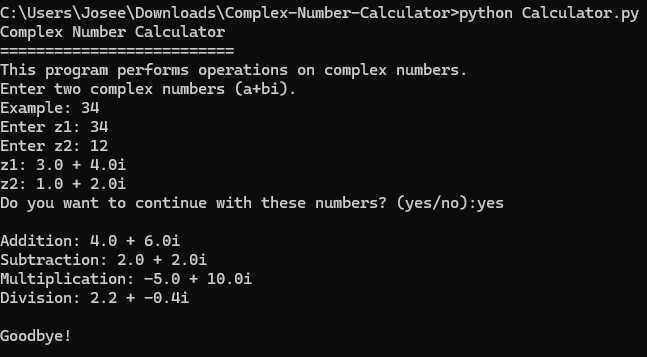

# Complex Number Calculator

This project is a complex number calculator that allows you to perform basic operations like addition, subtraction, multiplication, and division. The calculator is implemented in Python using the operations class, which handles complex numbers efficiently.

## Project Structure

- `classes/ComplexNumber.py`: Contains the operations class that defines operations with complex numbers.
- `main.py`: The main file that executes the program logic and allows user interaction.

## Features

- **Simple User Interface**: The program allows the user to enter two complex numbers and perform various operations between them.
- **Error Handling**: Basic error handling is included, such as division by zero.

### Supported Operations:

- Addition
- Subtraction
- Multiplication
- Division
- Conjugate (although not used in Calculator.py, it's available in the operations class)

## Usage Example

### Running the Program

1. When you start the program, you will be asked to enter two complex numbers in the form `a+bi`.
2. The program will display the complex numbers you entered.
3. You can choose whether to continue with those numbers or enter them again.
4. If you choose to continue, the program will perform addition, subtraction, multiplication, and division operations, and display the results.

## Installation

Clone this repository:

git clone https://github.com/Joseecodm/Complex-Number-Calculator.git

## Usage Example

### Running the Program

1. When you start the program, you will be asked to enter two complex numbers in the form `a+bi`.
2. The program will display the complex numbers you entered.
3. You can choose whether to continue with those numbers or enter them again.
4. If you choose to continue, the program will perform addition, subtraction, multiplication, and division operations, and display the results.

## Requirements

- Python 3.12
- `math` module from the standard library

## Contributions

Contributions are welcome. If you want to improve this project, feel free to fork it, create a new branch, make your changes, and submit a pull request. I will test it and merge it into the test branch, and then merge it into the main branch.

## License

This project is licensed under the Creative Commons Attribution-NonCommercial 4.0 International License (CC BY-NC 4.0). You may copy, modify, and distribute the code, but you may not use it for commercial purposes. For more details, see the `LICENSE` file.
